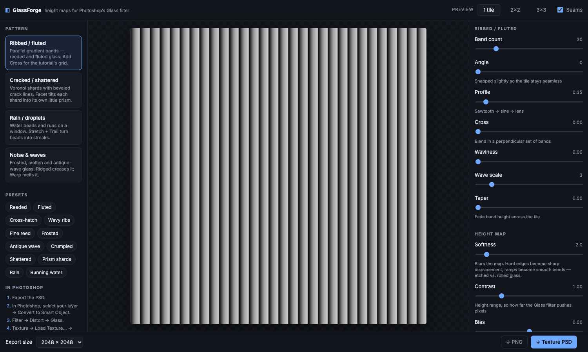
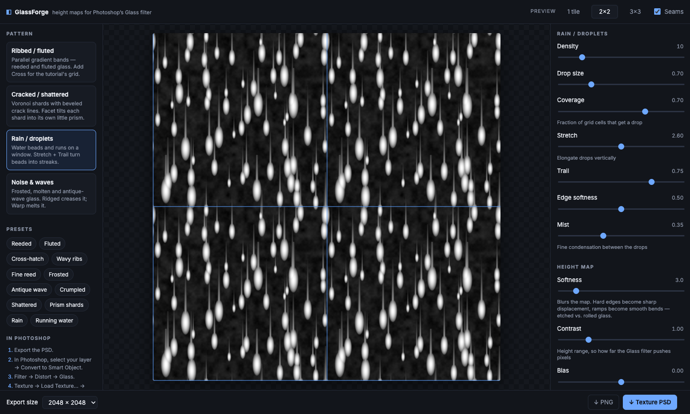

# GlassForge

A **glass height-map generator** that runs in the browser.

It makes the black-and-white texture that Photoshop's `Filter → Distort → Glass`
loads — parametrically, seamlessly tileable, previewable, and exported as the PSD
that filter insists on.

It is not a Photoshop replacement. It replaces the *tedious part* of making the
texture.



## Why

The Glass filter reads a PSD's **luminance as a height map** and pushes pixels
along its slope. The usual way to feed it is to build that texture by hand:
duplicate a black-to-transparent gradient thirty times, rasterise, unlink the
mask, rotate, group, save as PSD, load it, decide the ribs are too fine, and do
the whole thing again.

None of that is parametric, and none of it is reusable. Here the texture is a set
of sliders and a seed — change the rib count, re-export, done.

## Features

- **Four pattern families**, all seamlessly tileable
  - **Ribbed / fluted** — reeded glass. Band count, angle, a sawtooth→sine→lens profile morph, cross-hatch, waviness, taper
  - **Cracked / shattered** — Voronoi shards with beveled crack lines; each shard is a tilted plane, so it displaces in one consistent direction like a real prism instead of radially like a bubble
  - **Rain / droplets** — lens-profile beads with stretch, tapering runs and mist
  - **Noise & waves** — fbm, ridged fbm, domain warp and sine interference, for frosted, crumpled and antique glass
- **Height-map controls that map to what the filter does** — Softness (hard edge → sharp displacement, ramp → smooth bend), Contrast (height range, so displacement distance), Bias, Invert
- **Seam check** — draw the tile 2×2 or 3×3 with boundary guides

  

- **PSD export** — flat 8-bit single-channel grayscale, up to 4096², which is exactly what the Glass filter accepts. PNG too, for Blender displacement / AE Displacement Map / TouchDesigner
- **12 presets** and a seed for reproducible randomness
- Settings persist in `localStorage`; double-click any slider to reset it

## Run it

```bash
npm install
npm run dev        # http://localhost:5173
```

```bash
npm run build      # static files in dist/
npm run preview
```

Requires **WebGL2** — any current Chrome, Edge, Firefox or Safari.

Pushing to `main` deploys to GitHub Pages via `.github/workflows/deploy.yml`
(enable Pages → Source: GitHub Actions in the repo settings first).

## Using it in Photoshop

1. Tune a pattern, pick an export size, hit **↓ Texture PSD**.
2. In Photoshop, select your layer → **Convert to Smart Object** (keeps the filter re-editable).
3. **Filter → Distort → Glass**.
4. **Texture → Load Texture…** → the exported PSD.
5. Tune *Distortion*, *Smoothness* and *Scaling*.

Later, double-click **Filter Gallery** in the Layers panel to retune or swap the
texture without redoing anything.

Exports are square because the tiles are seamless — the Glass filter repeats one
across any document size, and its own *Scaling* slider handles apparent scale.

## How it works

Three GPU passes, re-run only when something changes:

| Pass | What it does |
|------|--------------|
| **Height** | Runs the selected pattern's `patternHeight(uv)` into a half-float target, then contrast / bias / invert |
| **Blur** ×2 | Separable Gaussian — the Softness control |
| **View** | Grayscale blit, optionally tiled with seam guides. Export takes the same blit at repeat 1 into a byte target and reads it back |

Half-float intermediates matter: an 8-bit height map bands visibly, and the Glass
filter turns each band step into a displacement edge.

The PSD writer (`src/export/psd.ts`, ~40 lines, no dependencies) emits header →
empty colour-mode/resources/layer sections → raw image data. Single channel,
8-bit, colour mode 1.

## Adding a pattern

One file, then one line. A pattern is a GLSL function plus a param schema — the
UI, uniforms, presets and export all read from that.

```ts
// src/patterns/hex.ts
import { Pattern, p } from "./types";

export const hex: Pattern = {
  id: "hex",
  name: "Hex bevel",
  blurb: "Honeycomb glass block.",
  params: [p("cells", "Cell count", 2, 40, 1, 10)],
  glsl: `
float patternHeight(vec2 uv) {
  // every param is in scope as u_<key>; u_seed too
  return /* 0..1 */;
}
`,
};
```

Then add it to `PATTERNS` in `src/patterns/registry.ts`. That's the whole change.

**Keep it tileable:** pass the same integer frequency you multiply `uv` by as the
`period` argument of `hash21p` / `hash22p` / `vnoise` / `fbm` / `voronoi`, and take
stripe directions from `stripeDir()`, which rounds them to integer vectors so
angled stripes still wrap. Helpers live in `src/patterns/common.glsl.ts`. Check
your work with the 2×2 preview.

## Layout

```
src/
  patterns/     pattern definitions + the shared GLSL prelude
  gl/           context, programs, render targets, shader sources, renderer
  ui/           tiny DOM helpers and generated controls
  export/       PNG encoder (canvas) and PSD writer (hand-rolled)
  state.ts      app state, defaults, persistence
  presets.ts    named starting points
```

## License

MIT
